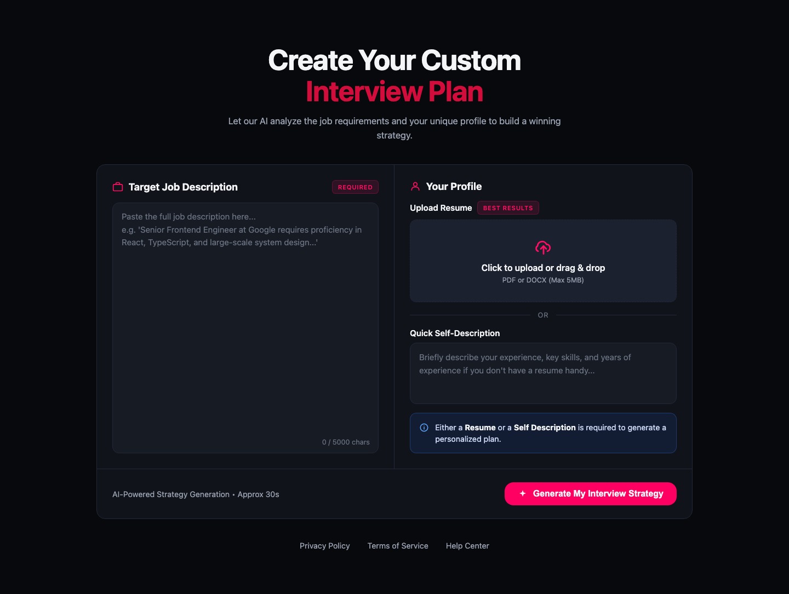
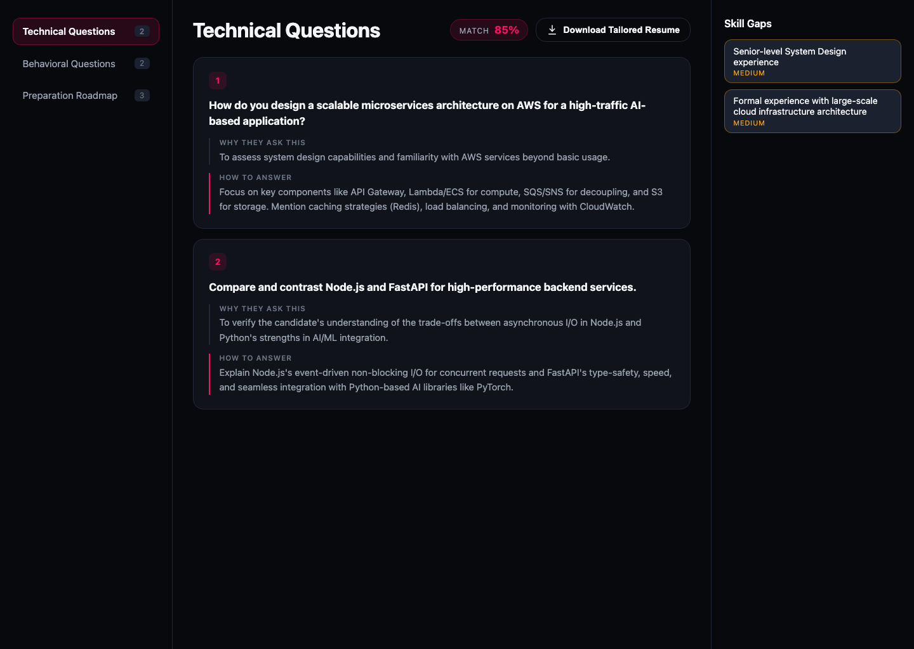

<div align="center">

# YT-GENAI

### AI interview prep, tailored to the job — not a generic quiz bank

Upload a resume and a job description. Get technical & behavioral questions written for *that*
role, a skill-gap analysis, a day-by-day prep roadmap, and a resume rewritten in LaTeX to target
the job — all generated by Gemini, compiled to a real PDF, in one click.

[](Backend)
[](Frontend)
[](Backend/src/models)
[](Backend/src/services/ai.service.js)
[](Backend/src/templates/resume.tex.hbs)
[](Frontend/vite.config.js)

</div>

---

## What it does

1. **Paste a job description**, and upload your resume (PDF) or a quick self-description.
2. Gemini reads both and generates:
   - Technical & behavioral interview questions, each with *why they ask this* and *how to answer*
   - A resume ↔ job **match score**
   - A **skill-gap** breakdown with severity
   - A **day-by-day preparation roadmap**
3. On the report, click **Download Tailored Resume** — Gemini rewrites your resume's content
   (same jobs, same order, reworded and retargeted toward the job description's language) and it's
   compiled into a real one-page PDF using your own LaTeX resume template.

<table>
<tr>
<td width="50%">

**Generate a plan**


</td>
<td width="50%">

**Get your report**


</td>
</tr>
</table>

## How the resume tailoring actually works

This is the part worth explaining, because it's not "ask an LLM to write LaTeX":

```
Gemini generates structured JSON            (name, reworded bullets, skills — plain text only,
        │                                    never LaTeX syntax)
        ▼
Every field is LaTeX-escaped in JS          (backslashes, braces, %, &, #, $, ~, ^ — all neutralized
        │                                    before anything touches the template)
        ▼
Handlebars fills a FIXED .tex template      (Gemini can't break the document's structure —
        │                                    it never sees LaTeX syntax to break)
        ▼
Tectonic compiles it to a PDF               (a self-contained LaTeX engine, no TeX Live install,
        │                                    no shell-escape support — safer for AI-derived content)
        ▼
Streamed straight back as a download        (never written to disk or the database — only the
                                              underlying content is cached, so a re-download is fast)
```

Content rules Gemini follows: every education/experience/project entry stays in the original
order (nothing added, removed, or reordered), bullets are reworded toward the job description but
kept close to their original length, and skills can only be added if they're actually evidenced
in the resume — never invented.

## Tech stack

| | |
|---|---|
| **Backend** | Node.js, Express 5, MongoDB (Mongoose), JWT auth, Multer |
| **AI** | Google Gemini (`@google/genai`), structured output validated with Zod |
| **Resume PDF pipeline** | Handlebars (template fill) → [Tectonic](https://tectonic-typesetting.github.io/) (LaTeX → PDF) |
| **Frontend** | React 19, React Router, Vite, Sass |
| **Auth** | httpOnly cookies, bcrypt password hashing, token blacklist on logout |

## Project structure

```
YT-GENAI/
├── Backend/
│   ├── src/
│   │   ├── controllers/     # auth.controller.js, interview.controller.js
│   │   ├── services/        # ai.service.js (interview reports), resume.service.js (tailored resume)
│   │   ├── models/          # user, interviewReport, blacklistToken
│   │   ├── templates/       # resume.tex.hbs — the fixed LaTeX skeleton
│   │   ├── utils/           # latexEscape.js
│   │   └── middlewares/     # auth, file upload
│   └── scripts/setup-tectonic.sh
├── Frontend/
│   └── src/features/
│       ├── auth/             # login, register, session context
│       └── interview/        # 4-layer: pages → hooks → context → api
└── SETUP.md                  # full local setup walkthrough
```

## Quick start

```bash
# Backend
cd Backend
cp .env.example .env        # fill in MONGO_URL, JWT_SECRET, GOOGLE_GENAI_API_KEY
npm install
npm run setup:tectonic      # one-time: installs the LaTeX engine for resume PDFs
npm run dev

# Frontend
cd Frontend
npm install
npm run dev
```

Full walkthrough, troubleshooting, and the checklist for reopening the project after a break: see
**[SETUP.md](SETUP.md)**.

## API

| Method | Route | Description |
|---|---|---|
| `POST` | `/api/auth/register` | Create an account |
| `POST` | `/api/auth/login` | Log in |
| `GET` | `/api/auth/logout` | Log out, blacklist the token |
| `GET` | `/api/auth/get-me` | Current session |
| `POST` | `/api/interview` | Generate an interview report from a resume/self-description + job description |
| `GET` | `/api/interview` | List the user's reports |
| `GET` | `/api/interview/report/:id` | Fetch one report |
| `POST` | `/api/interview/report/:id/resume` | Generate (or reuse) and download the tailored resume PDF |

All routes except register/login require the session cookie.
